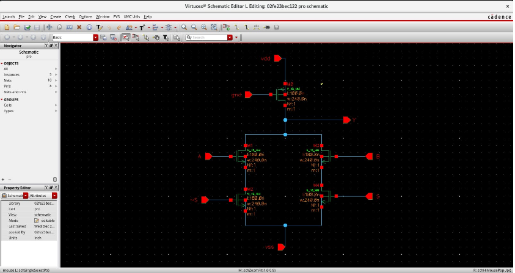
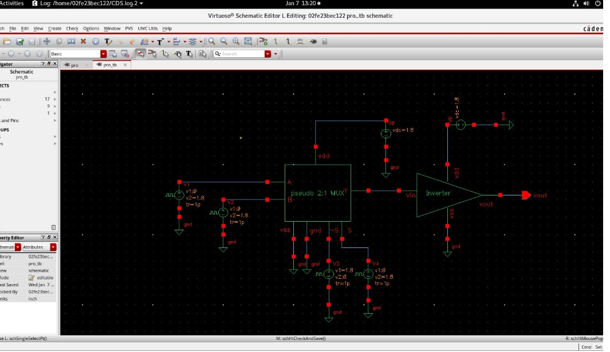
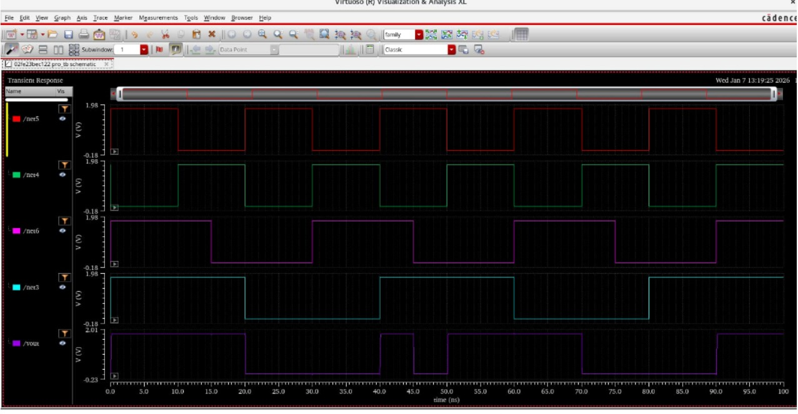

# Pseudo-NMOS Based 2:1 Multiplexer Design using Cadence Virtuoso

## Objective

Design and analyze a 2:1 multiplexer using pseudo-NMOS logic and verify its functionality through transient simulation in Cadence Virtuoso.

---

## Concept

Pseudo-NMOS logic uses an always-ON PMOS transistor as the pull-up network and NMOS transistors as the pull-down network.
This reduces transistor count compared to conventional CMOS logic but introduces static power dissipation and degraded output levels.

To overcome degraded logic levels, a CMOS inverter is added at the output to restore full voltage swing and improve noise margin.

---

## Circuit Description

* Inputs: A, B
* Select Line: S
* Output: Y
* Supply Voltage: 1.8V
* Logic Style: Pseudo-NMOS

The select signal controls the NMOS network to choose between inputs A and B. The PMOS transistor remains always ON, providing a constant pull-up path.

---

## Tools Used

* Cadence Virtuoso (Schematic Editor & Simulation)

---

## Design Implementation

The circuit consists of:

* A single always-ON PMOS transistor acting as pull-up
* NMOS transistors forming the pull-down network
* Output node connected to an inverter for signal restoration

---

## Testbench Setup

* Pulse voltage sources are applied to inputs A, B, and select line S
* DC supply voltage of 1.8V is used
* Output of pseudo-NMOS MUX is connected to a CMOS inverter

---

## Simulation Results

* Transient analysis verifies correct multiplexer operation
* Output follows selected input based on select signal
* Degraded logic level observed before inverter
* Full logic swing achieved after inverter

---

## Key Observations

* Reduced transistor count compared to CMOS implementation
* Static power dissipation due to always-ON PMOS
* Degraded high-level output in pseudo-NMOS logic
* CMOS inverter restores full voltage levels
* Trade-off between power, area, and performance

---

## Conclusion

The pseudo-NMOS based 2:1 multiplexer was successfully designed and simulated using Cadence Virtuoso.
The design demonstrates reduced hardware complexity but highlights limitations such as static power consumption and degraded output levels, which are mitigated using a CMOS inverter.

---

